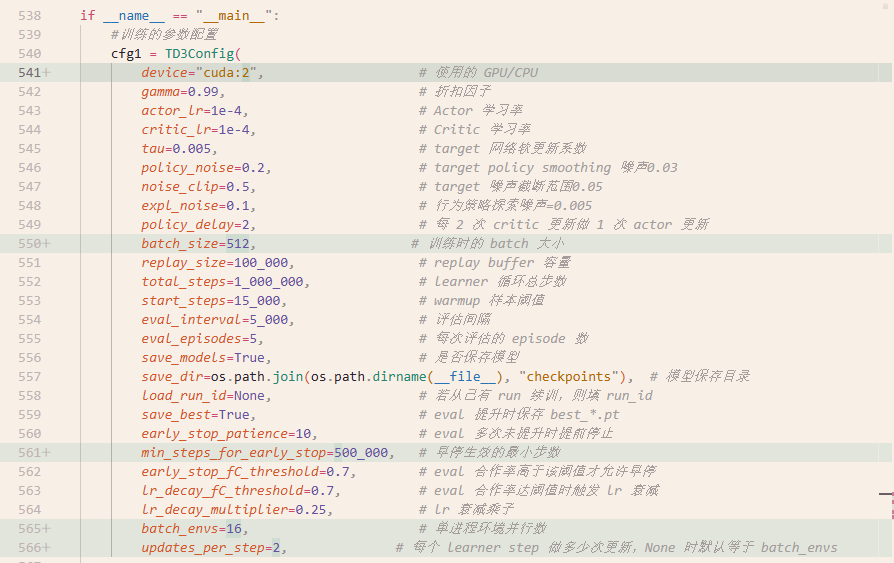

# 算法调试

针对你的 TD3 算法在空间公共物品博弈（SPGG）中出现的“高合作后崩塌”且不收敛的问题，除了之前提到的超参数调整（Batch Size、Learning Rate），从**算法框架**和**网络结构**的深层角度来看，这里有几个非常关键的改进建议。

核心痛点分析：你的 Agent 目前可能处于“**盲目飞行**”状态——它只能看到当前的合作状态，却看不到支撑合作的“燃料”（资源 $R$）是否即将耗尽。

以下是具体的提升建议，按优先级排序：

### 1. 关键改进：在状态输入中加入“资源图层” (State Representation)

这是目前代码中最大的潜在隐患。

- **问题**：查看你的 `env.py` 中的 `get_state` 函数，输入给网络的 `state` 只包含三个通道：

  1. `Stra_now` (0/1): 当前是否合作。
  2. `Stra_prev` (0/1): 上一轮是否合作。
  3. `P_map`: 归一化后的公共池收益。

- **盲点**：Agent **看不到累计资源 $R$ 的具体数值**。它只知道 $R \ge \text{cost}$ 时是 1（合作），否则是 0。

  - 想象一下：当 $f_C=0.8$ 时，如果所有人的资源 $R=100$，系统非常稳健；如果 $R=5.1$（刚过成本线），系统即将崩塌。
  - 对于你的神经网络（尤其是 Critic），这两种状态看起来**完全一样**（输入都是 1）。因此，Critic 无法预测即将到来的崩塌，认为当前状态价值很高，直到 $R$ 耗尽瞬间崩塌，Critic 才会感到“震惊”，但为时已晚。

- **建议**：修改 `env.py`，增加第四个通道——**归一化的资源图层**。

  Python

  ```
  # 在 env.py 的 get_state 中
  # 归一化建议：可以用 R / (initial_R * 2) 或者 log(R + 1) 进行压缩
  R_norm = np.clip(self.R / 100.0, 0, 1).astype(np.float32) 
  state = np.stack([stra_now, stra_prev, P_map, R_norm], axis=0)
  ```

  同时记得修改 `global_trainer.py` 和 `planner_net.py` 中 `ActorNet/CriticNet` 的 `in_channels` 参数（从 3 改为 4）。这能让 Critic 准确判断“系统的健康度”。

### 2. 网络结构：扩大感受野 (Receptive Field)

- **问题**：目前的 `ConvBody` 只有 3 层 $3\times3$ 卷积。
  - 这意味着每个格点的输出只取决于周围 $7\times7$ 的区域。
  - 在空间博弈中，背叛者的“入侵”往往像波浪一样传播。如果感受野太小，Agent 无法感知远处传来的“背叛波”，也就无法提前做出防御性分配（例如在边界处切断背叛者的收益）。
- **建议**：
  1. **增加空洞卷积 (Dilated Convolution)**：将中间层的 `dilation` 设为 2 或 4。这可以在不增加参数量的情况下，成倍扩大感受野，让 Agent 拥有“全局视野”。
  2. **引入全局特征**：在 Critic 网络的的全连接层之前，除了卷积特征，额外拼接一些全局统计量（如当前的全局 $f_C$、全局平均 $R$）。这能帮助 Critic 区分局部震荡和全局崩塌。

### 3. 算法机制：优先经验回放 (Prioritized Experience Replay, PER)

- **问题**：你的训练日志显示崩塌是偶发的。在 `ReplayBuffer` 中，90% 的样本可能都是“高合作、高奖励”的平庸样本，而那些“从高合作开始崩塌”的**关键负样本**非常稀少。
- **后果**：在随机采样（Uniform Sampling）下，这些关键教训被淹没了，导致 Critic 总是“记吃不记打”。
- **建议**：实现 **PER**（Prioritized Experience Replay）。根据 TD-error 对样本加权，让那些预测误差大（即崩塌瞬间）的样本被更频繁地采样和训练。这能强迫模型重点学习“如何避免崩塌”。

### 4. 训练技巧：N-step Returns (N步回报)

- **问题**：资源耗尽导致的崩塌具有**滞后性**。当前的动作可能在 5-10 步之后才导致资源 $R$ 跌破阈值。TD3 默认的 1-step TD loss 传递这种延迟惩罚非常慢。
- **建议**：使用 **N-step Returns**（例如 $N=3$ 或 $N=5$）。
  - $Q(s, a) \approx r_t + \gamma r_{t+1} + \dots + \gamma^n Q(s_{t+n}, a_{t+n})$
  - 这能让 Critic 更快地将未来的崩塌惩罚关联到当前的错误动作上。

### 总结行动路线

如果不改动太大，**性价比最高**的方案是：

1. **修改输入**：立刻把 **$R$ (资源)** 加进状态通道。（这极有可能直接解决收敛后崩塌的问题）。
2. **调参**：配合之前说的大 Batch Size 和小 Learning Rate。

如果愿意改动代码结构：

3. 改网络：把中间的卷积层改成 dilation=2。
4. 改Loss：实现 N-step Return 计算 Target Q。


## 12.1结果：


20251203_151223参数




20251203_133419


20251205_214027

参数


